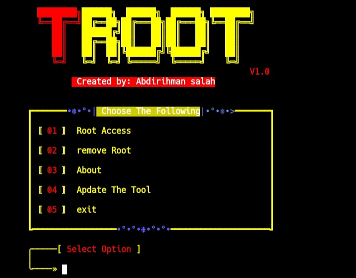

# TRoot
TRoot is a tool uses to root only termux without mobile root, and helps to root, remove Root,  update root, in your termux, 
# Troot-image

# installation
$ `apt install git`

$ `termux-setup-storage`

$ `git clone https://github.com/AbdirihmanSalah/TRoot`

$ `cd TRoot`

$ `chmod +x TRoot.sh`

$ `./TRoot.sh`

Always Run/Markasta Kusoo kici

$ `Troot`

# creater 

by: Abdirihman salah 

# Support us

